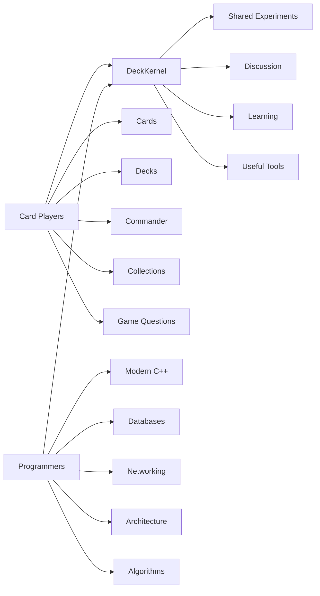
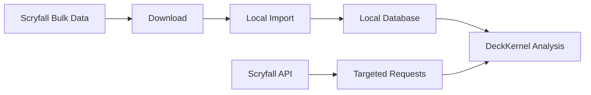
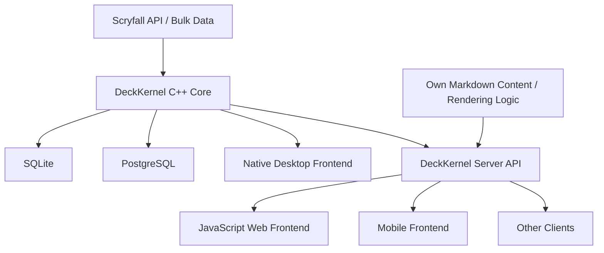
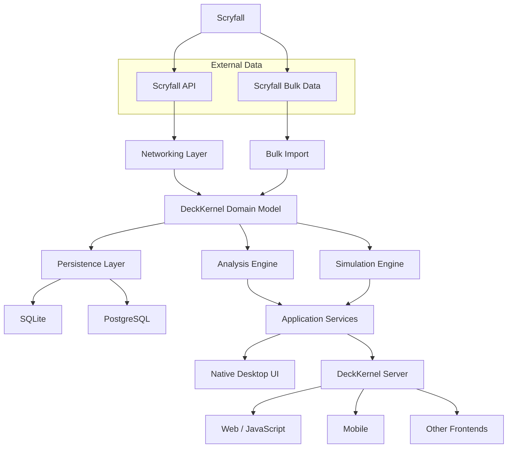
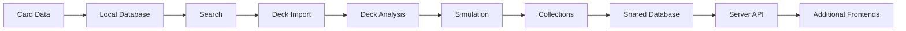
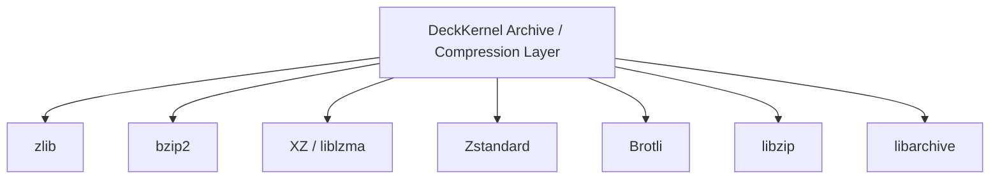
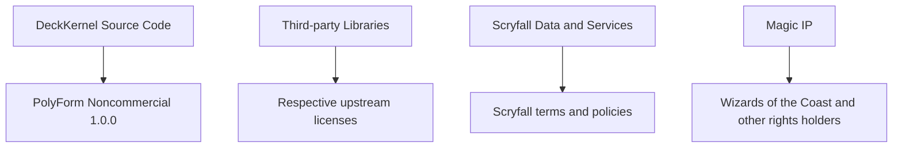

# DeckKernel

> **Where cards meet code — and generations meet around both.**

DeckKernel is a non-commercial learning and community project built around a simple idea: use a real card game, real data, and real software-engineering problems to explore modern C++ together.

The project started from conversations with my sons, who play **Magic: The Gathering** and brought the idea to me. That creates an interesting meeting point between generations: they bring the game, the cards, the deck ideas, and the questions that matter to players; I can use the same project to show what I actually do professionally as a software architect and developer.

That is the spirit of DeckKernel.

It is not intended to become a commercial product. There is no financial interest behind the project. Instead, it should be something that card players and programmers can build, discuss, question, test, and improve together.

For card players, the project should remain connected to the real game and to practical questions around cards, decks, collections, probabilities, and analysis.

For programmers, it should be a substantial learning project using modern C++, networking, APIs, databases, data modelling, compression, security, testing, simulation, and later possibly the interaction between a native C++ backend and completely different frontends.

And ideally, both groups meet somewhere in the middle.

---

## What is DeckKernel?

DeckKernel is an experimental, source-available C++ project for working with card and deck data from **Magic: The Gathering**, initially with a strong focus on Commander.

The project uses the **Scryfall API and Scryfall Bulk Data** as its primary external source for card metadata.

It is intentionally not designed as one large finished application from the beginning.

We will build it step by step.

Each stage should introduce a real technical or domain problem:

- retrieving and updating card data,
- understanding the Scryfall data model,
- storing structured data locally,
- importing decks,
- analysing mana and card roles,
- working with probabilities,
- simulating game situations,
- comparing deck revisions,
- dealing with collections,
- sharing data between systems,
- exposing backend functionality to other applications,
- and eventually connecting different frontends to the same C++ core.

The journey is at least as important as the final program.

---

## A project for players and programmers

DeckKernel deliberately connects two worlds.

A player does not need to be a C++ expert to contribute a useful idea.

A programmer does not need to know every Magic rule before contributing to the architecture.

Questions from both sides are valuable.

Examples include:

- Why does this deck frequently miss its fourth land?
- How many coloured mana sources are actually required?
- How should different printings of one card be represented?
- What should be stored locally and what should be requested from Scryfall?
- When is SQLite sufficient and when does PostgreSQL become useful?
- How can simulation results be reproduced?
- How can a desktop application later expose the same functionality to a browser or phone?
- How do we keep the architecture understandable while the project grows?

These are exactly the kinds of questions DeckKernel is intended to explore.

---

## Development in public

DeckKernel will be developed openly.

A significant part of the development will happen during live streams. The streams should show real software development rather than only polished final results.

That includes successful ideas, failed ideas, design discussions, compiler problems, performance questions, refactoring, database decisions, and changing assumptions.

We hope that people will participate with:

- ideas,
- questions,
- criticism,
- card-game knowledge,
- test scenarios,
- deck examples,
- architecture discussions,
- C++ suggestions,
- database experience,
- and completely different perspectives.

The project should grow from concrete use cases and discussion rather than from a fixed feature catalogue written before we have learned enough.

---

## Non-commercial by design

DeckKernel is intentionally a **non-commercial project**.

The goal is learning, experimentation, discussion, and community participation.

The source code should be visible so that people can inspect it, learn from it, modify it for permitted non-commercial purposes, and discuss how it works.

The public project is therefore licensed under the:

**PolyForm Noncommercial License 1.0.0**

https://polyformproject.org/licenses/noncommercial/1.0.0/

The public license does not grant permission for commercial use.

In particular, publishing the source code is not intended to allow unrelated third parties to turn DeckKernel, modified DeckKernel versions, or DeckKernel-derived software into a commercial product or commercial service.

Any commercial use would require a separate written license from the relevant copyright holder or copyright holders.

Because of that restriction, DeckKernel should be described as **source-available**, not as OSI-approved open-source software.

Third-party libraries remain under their own licenses.

---

## Magic: The Gathering and Scryfall

**Magic: The Gathering** is created and published by Wizards of the Coast.

DeckKernel is an independent fan and learning project.

It is not approved, endorsed, sponsored, or affiliated with Wizards of the Coast or Scryfall.

The project uses the **Scryfall API** and **Scryfall Bulk Data** to work with Magic card metadata.

Scryfall is an important part of the project because it gives us something extremely valuable for a learning application: a large, real, evolving, structured dataset connected to an actual game and an active community.

DeckKernel does not relicense Magic content, Scryfall content, card artwork, card text, symbols, trademarks, or other third-party intellectual property under the DeckKernel software license.

Where practical, the repository should contain project-owned source code, schemas, tests, and documentation rather than copies of card data or artwork.

Runtime or development data should be obtained through the interfaces and downloads provided by Scryfall.

Relevant references:

- Wizards of the Coast Fan Content Policy  
  https://company.wizards.com/en/legal/fancontentpolicy

- Scryfall  
  https://scryfall.com/

- Scryfall API  
  https://scryfall.com/docs/api

- Scryfall Bulk Data  
  https://scryfall.com/docs/api/bulk-data

---

## Responsible Scryfall usage

DeckKernel should avoid unnecessary traffic against Scryfall.

For larger datasets, the preferred approach is:

Bulk Data should be used whenever large-scale local processing is appropriate.

Direct API requests should be cached where useful and must follow Scryfall's current access requirements.

The implementation should also identify itself with meaningful HTTP headers and respect Scryfall's published rate limits and service guidance.

---

## Age requirement

**DeckKernel is intended for users aged 13 and older.**

This is a project requirement because the application uses Scryfall-backed online services and Magic-related online content.

Local law, parental rules, or the terms of an external service may require additional restrictions or a higher minimum age.

DeckKernel is not intended for children under 13.

---

## Why C++Builder 13 Community Edition?

One goal of DeckKernel is to make modern C++ visible and approachable.

The primary Windows development environment is therefore:

### Embarcadero C++Builder 13 Community Edition

C++Builder 13 CE is available from Embarcadero for eligible users and provides the modern Win64 Clang-based toolchain with substantial C++23 support.

That makes it interesting for this project for two reasons.

First, DeckKernel can use modern C++ language and library features instead of teaching an intentionally outdated subset of the language.

Second, the Community Edition makes it possible for eligible students, hobby developers, freelancers, and small teams to follow the project without first purchasing a professional C++Builder license.

The project should therefore be useful both for experienced C++ developers and for people who want to see what a modern native C++ application looks like in practice.

C++Builder Community Edition:

https://www.embarcadero.com/products/cbuilder/starter

Community Edition FAQ:

https://www.embarcadero.com/products/delphi/starter/faq

C++Builder itself is subject to Embarcadero's own license and eligibility requirements. The DeckKernel license grants no rights to C++Builder.

---

## What we want to learn

DeckKernel is deliberately broad enough to connect multiple areas of software development.

### Modern C++

The C++ core should use modern language and library facilities where they improve the design.

Possible topics include:

- C++23,
- concepts,
- ranges,
- templates,
- compile-time programming,
- RAII,
- value semantics,
- coroutines,
- asynchronous processing,
- parallel analysis,
- type-safe domain modelling,
- testing,
- benchmarking,
- and performance measurement.

### Networking

Scryfall gives us a practical reason to work with real network communication.

The project can compare and use technologies such as:

- Boost.Asio,
- Boost.Beast,
- curl / libcurl,
- TLS,
- OpenSSL,
- REST-style APIs,
- caching,
- and eventually our own service endpoints.

### Data formats

Real systems rarely use only one format.

DeckKernel will initially rely heavily on JSON, but XML and other formats may appear where useful.

Libraries currently considered or already integrated include:

- nlohmann/json,
- pugixml,
- and project-owned serialization logic where appropriate.

### Databases

Cards, printings, decks, collections, analyses, and experiments give us a meaningful database problem rather than an artificial tutorial schema.

The project is expected to use:

- **SQLite** for local, self-contained storage,
- **PostgreSQL** for shared, server-backed, or larger installations.

This gives us an opportunity to compare embedded and client/server database architectures using the same domain.

---

## From desktop application to backend and frontends

The first steps are intentionally local.

The long-term architecture, however, should not assume that the user interface and the analysis engine must always live in the same process.

One possible development direction is:

This is a direction, not a promise that every component will be built immediately.

The important architectural idea is that the domain model, analysis, simulation, and data access should remain useful independently of one particular user interface.

A native C++ desktop application may therefore be the first frontend rather than the final boundary of the system.

Later, a DeckKernel server could expose selected functionality to:

- JavaScript applications,
- browser interfaces,
- mobile clients,
- educational demonstrations,
- dashboards,
- or other software.

---

## Our own Markdown-based server content

Later in the project we plan to provide a server that uses our **own Markdown processing and presentation logic**.

The goal is not merely to host static documentation.

Markdown can become part of a lightweight content system for:

- project documentation,
- analysis reports,
- tutorials,
- card and deck explanations,
- experiment results,
- streamed development notes,
- technical articles,
- and potentially interactive content connected to the DeckKernel backend.

This also gives us another real engineering topic:

> How do native backend services, structured data, generated analysis, Markdown content, and arbitrary frontends work together cleanly?

---

## Planned architecture

The exact architecture will evolve as the project grows.

A current high-level direction is:

The first versions will be much smaller than this diagram.

That is intentional.

---

## Step-by-step development

A possible progression is:

Each stage should remain usable and understandable on its own.

We explicitly do not want to build a large speculative framework before the earlier steps have demonstrated that the abstractions are useful.

---

## Third-party software

DeckKernel uses or may use a number of third-party libraries.

The library stack is deliberately broad enough to support a real application, while still being accessible to people following the project.

Each third-party component remains under its **own license**.

The DeckKernel license does not replace, restrict, or relicense third-party software.

The following table is an architectural overview and does not replace the license files of the individual projects.

| Component | Intended use | License |
|---|---|---|
| Boost.Asio | asynchronous I/O, networking, timers | Boost Software License 1.0 |
| Boost.Beast | HTTP and WebSocket building blocks | Boost Software License 1.0 |
| curl / libcurl | HTTP(S) transfers and interoperability | curl license |
| OpenSSL 3.x | TLS and cryptographic support | Apache License 2.0 |
| nlohmann/json | JSON parsing and serialization | MIT License |
| pugixml | optional XML parsing and serialization | MIT License |
| SQLite | local embedded database | Public Domain |
| PostgreSQL / libpq | PostgreSQL client and server integration | PostgreSQL License |
| libpqxx | optional C++ PostgreSQL client wrapper if used | BSD 3-Clause |
| zlib | DEFLATE compression | zlib License |
| bzip2 / libbzip2 | bzip2 compression | bzip2 License |
| XZ Utils / liblzma | XZ and LZMA compression | liblzma: 0BSD; additional XZ Utils files may use other licenses |
| Zstandard / zstd | Zstandard compression | BSD-style license or GPLv2 option; DeckKernel distributions should use the permissive BSD licensing path |
| Brotli | Brotli compression | MIT License |
| libzip | ZIP archive access | BSD 3-Clause |
| libarchive | multi-format archive access | predominantly BSD-style licensing; individual files control |

---

## Compression and archive stack

Archive and compression support is useful beyond packaging.

It may be required for:

- downloaded datasets,
- local caches,
- imports,
- exports,
- backups,
- test data,
- server-side content,
- and future distribution formats.

The current or planned stack includes:

Not every build has to use every library directly.

Some components may be introduced transitively through other dependencies or enabled only by specific build options.

---

## Transitive dependencies

A README can never be the final authority for the dependency closure of an actual binary.

Dependencies may change with:

- platform,
- compiler,
- configuration,
- enabled features,
- static or dynamic linkage,
- database backend,
- TLS backend,
- and archive-format support.

Therefore:

1. the actual dependency closure of a DeckKernel build is authoritative,
2. every distributable build must retain all notices required by its resolved dependencies,
3. `THIRD_PARTY_NOTICES.md` or an equivalent generated notice document should be created from the actual build configuration,
4. optional functionality must not silently introduce an incompatible license,
5. direct and transitive dependencies should remain reproducible through the build system.

---

## License separation

The project contains several legally separate layers.

No statement in the DeckKernel repository should be interpreted as granting rights to third-party intellectual property.

---

## Current project philosophy

DeckKernel should prefer:

- transparent algorithms over unexplained scores,
- reproducible calculations over opaque recommendations,
- measurable behaviour over assumptions,
- local processing where practical,
- explicit data provenance,
- clear separation between external data and project-owned code,
- incremental development over speculative architecture,
- modern C++ over artificially simplified teaching code,
- understandable architecture over unnecessary abstraction,
- and discussion over pretending that every design decision is obvious.

Where DeckKernel produces recommendations or analytical results, the long-term goal is to make both the input data and the reasoning inspectable.

---

## Possible future areas

The project may eventually explore:

- Commander deck analysis,
- probability calculations,
- mana-base analysis,
- mulligan models,
- deck revision comparison,
- simulation,
- collection management,
- new-set impact analysis,
- card substitution experiments,
- PostgreSQL-backed shared data,
- server APIs,
- browser frontends,
- mobile clients,
- Markdown-based project and analysis content,
- and other ideas contributed by the community.

These are possibilities rather than a fixed roadmap.

The project should remain free to change direction when we learn something better.

---

## Contributing ideas

At the beginning, the most valuable contributions may not be code.

Useful contributions include:

- real deck examples,
- questions existing tools do not answer well,
- interesting Commander situations,
- test cases,
- expected calculations,
- database-model suggestions,
- architecture criticism,
- performance ideas,
- UI ideas,
- documentation,
- and discussion.

A separate contribution policy may be added before substantial third-party source contributions are accepted.

---

## Disclaimer

DeckKernel is experimental software and is provided without warranty.

Card data, legality information, rulings, prices, external APIs, and other third-party information may change.

DeckKernel must not be treated as an authoritative replacement for current information from Wizards of the Coast, Scryfall, tournament organizers, retailers, or other primary sources.

Price information, if added later, is informational only.

---

## References

### Magic and Scryfall

- Wizards of the Coast Fan Content Policy  
  https://company.wizards.com/en/legal/fancontentpolicy

- Scryfall  
  https://scryfall.com/

- Scryfall API  
  https://scryfall.com/docs/api

- Scryfall Bulk Data  
  https://scryfall.com/docs/api/bulk-data

### Development environment

- Embarcadero C++Builder Community Edition  
  https://www.embarcadero.com/products/cbuilder/starter

- Community Edition FAQ  
  https://www.embarcadero.com/products/delphi/starter/faq

### License

- PolyForm Noncommercial License 1.0.0  
  https://polyformproject.org/licenses/noncommercial/1.0.0/

### Selected third parties

- Boost  
  https://www.boost.org/

- curl  
  https://curl.se/

- OpenSSL  
  https://openssl-library.org/

- nlohmann/json  
  https://github.com/nlohmann/json

- SQLite  
  https://sqlite.org/

- PostgreSQL  
  https://www.postgresql.org/

- libpqxx  
  https://pqxx.org/libpqxx/

- pugixml  
  https://pugixml.org/

- libarchive  
  https://www.libarchive.org/

---

## Final note

DeckKernel begins with a card game, but it is really about something larger.

It is about taking a real-world domain seriously enough to model it properly.

It is about showing that modern C++ can be used for something understandable and visible outside the usual systems-programming examples.

It is about databases, APIs, probability, architecture, frontends, and all the connections between them.

It is about players explaining the game to programmers and programmers explaining the software to players.

And, on a personal level, it began because my sons brought their game to me and asked whether we could build something around it.

That makes DeckKernel a good place for generations to meet as well.

If that sounds interesting, join the discussion.
