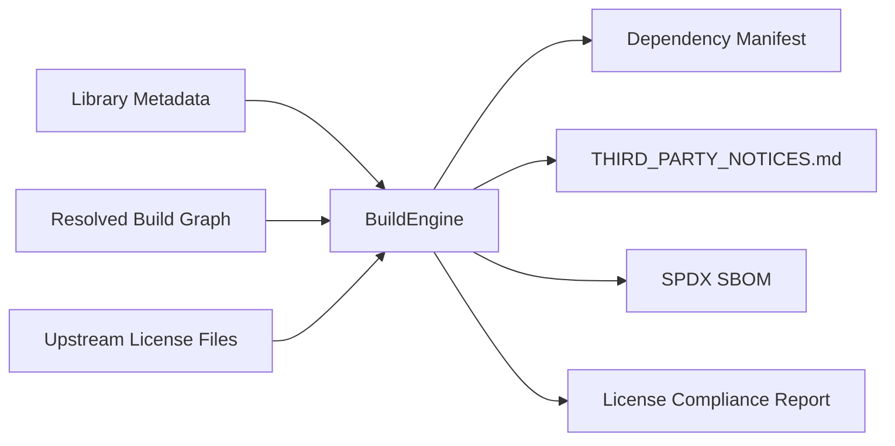

# Third-Party Notices

This document lists third-party software, libraries, data services, and related components used by or intended for use by **DeckKernel**.

DeckKernel itself is licensed separately under the **PolyForm Noncommercial License 1.0.0**.  
Nothing in the DeckKernel license changes, replaces, restricts, or relicenses any third-party component listed here.

Each third-party component remains subject to its own copyright notices, license terms, attribution requirements, and other conditions.

> **Status:** Draft
>
> This file is intended to become partly generated from the actual DeckKernel build dependency closure.  
> The dependency graph produced by the build system is authoritative for a specific binary distribution.

---

## 1. Purpose of this file

DeckKernel deliberately builds on the wider C and C++ open-source ecosystem.

The project uses these libraries not only as implementation details, but also as part of its educational goal: to demonstrate how mature open-source components can be combined in a real application using modern C++ and C++Builder 13 CE while keeping the architecture open to other conforming C++ compilers and platforms.

For a source checkout, this document provides an overview of relevant licenses.

For a binary distribution, this document must be updated from the **actual resolved dependency closure** of that build.

A final release should therefore contain:

1. this notice document,
2. all license and copyright notices required by the resolved dependencies,
3. verbatim copies of upstream license texts where required or appropriate,
4. version information for every distributed component,
5. information about optional and transitive components that are actually present in the binaries.

---

## 2. DeckKernel license is separate

DeckKernel source code:

- **License:** PolyForm Noncommercial License 1.0.0
- **Project model:** source-available, non-commercial
- **License text:** https://polyformproject.org/licenses/noncommercial/1.0.0/

Third-party libraries listed below are **not** covered by the DeckKernel license.

Their respective upstream licenses apply independently.

---

## 3. Build-generated dependency inventory

The following section is intended to be replaced or supplemented by build-generated information.

```text
Build:
    DeckKernel version:       <generated>
    Build configuration:      <generated>
    Compiler:                 <generated>
    Target platform:          <generated>
    Architecture:             <generated>
    Build timestamp:          <generated>
    Dependency manifest hash: <generated>
```

<!-- BEGIN GENERATED DEPENDENCY INVENTORY -->

```text
<generated dependency inventory goes here>
```

<!-- END GENERATED DEPENDENCY INVENTORY -->

The generated inventory should preferably contain at least:

- component name,
- resolved version,
- direct or transitive status,
- static or dynamic linkage,
- license identifier,
- upstream source location,
- hash of the packaged library or source archive,
- and the path of the corresponding upstream license file.

---

## 4. Summary

| Component | Role in DeckKernel | License / status | SPDX identifier |
|---|---|---|---|
| Boost.Asio | asynchronous I/O, networking, timers | Boost Software License 1.0 | `BSL-1.0` |
| Boost.Beast | HTTP and WebSocket support | Boost Software License 1.0 | `BSL-1.0` |
| curl / libcurl | HTTP(S) transfers | curl license | `curl` |
| OpenSSL 3.x | TLS and cryptography | Apache License 2.0 | `Apache-2.0` |
| nlohmann/json | JSON parsing and serialization | MIT License | `MIT` |
| pugixml | optional XML parsing and serialization | MIT License | `MIT` |
| SQLite | embedded local database | Public Domain | `blessing` / public-domain status; verify packaged metadata |
| PostgreSQL / libpq | PostgreSQL client/server access | PostgreSQL License | `PostgreSQL` |
| libpqxx | optional C++ PostgreSQL wrapper | BSD 3-Clause | `BSD-3-Clause` |
| zlib | DEFLATE compression | zlib License | `Zlib` |
| bzip2 / libbzip2 | bzip2 compression | bzip2 License | `bzip2-1.0.6` |
| XZ Utils / liblzma | XZ/LZMA compression | core library 0BSD; additional files may differ | `0BSD` for current core |
| Zstandard / libzstd | Zstandard compression | BSD-style OR GPLv2; DeckKernel selects BSD path | `BSD-3-Clause` for selected path |
| Brotli | Brotli compression | MIT License | `MIT` |
| libzip | ZIP archive access | BSD 3-Clause | `BSD-3-Clause` |
| libarchive | multi-format archive and compression support | predominantly BSD-style, file-specific notices apply | typically BSD-style; inspect packaged files |

This table is an overview only.  
The actual license files in the resolved source packages remain authoritative.

---

# 5. Networking and HTTP

## 5.1 Boost.Asio

**Purpose in DeckKernel**

Boost.Asio provides portable asynchronous I/O, networking, timers, and related primitives.

**License**

Boost Software License 1.0 (`BSL-1.0`)

**Upstream**

https://www.boost.org/

**License**

https://www.boost.org/users/license.html

**Notice**

Boost Software License 1.0 permits use, modification, and redistribution under its terms.  
The complete upstream license text should be retained with source redistributions and wherever otherwise required by the upstream distribution.

For binary-only distributions, the exact obligations of the Boost Software License should be evaluated against the form in which Boost components are redistributed.

---

## 5.2 Boost.Beast

**Purpose in DeckKernel**

Boost.Beast provides HTTP and WebSocket protocol support on top of Boost.Asio.

**License**

Boost Software License 1.0 (`BSL-1.0`)

**Upstream**

https://www.boost.org/libs/beast/

Boost.Beast is part of Boost and uses the Boost Software License 1.0.

---

## 5.3 curl / libcurl

**Purpose in DeckKernel**

libcurl may be used as an HTTP(S) transfer backend and for interoperability with external services.

**License**

curl license (`curl`)

**Upstream**

https://curl.se/

**License**

https://curl.se/docs/copyright.html

**Copyright notice**

The upstream copyright notice currently identifies Daniel Stenberg and contributors.

The complete notice from the exact packaged curl release must be included where required.

**Important**

The curl license is permissive but is not identical to the MIT license.  
The original curl copyright and permission notice must be preserved as required by the upstream license.

---

# 6. TLS and cryptography

## 6.1 OpenSSL 3.x

**Purpose in DeckKernel**

OpenSSL provides TLS and cryptographic functionality.

**License**

Apache License 2.0 (`Apache-2.0`) for OpenSSL 3.0 and later releases derived from it.

**Upstream**

https://openssl-library.org/

**License**

https://openssl-library.org/source/license/

**Important**

DeckKernel currently targets the OpenSSL 3.x licensing model.

Older OpenSSL branches before 3.0 use different licensing terms and must **not** automatically be covered by this notice.

A release package must include the license text from the exact OpenSSL version used.

---

# 7. Structured data

## 7.1 nlohmann/json

**Purpose in DeckKernel**

JSON parsing, serialization, and interaction with Scryfall data.

**License**

MIT License (`MIT`)

**Upstream**

https://github.com/nlohmann/json

**Notice**

The upstream MIT copyright and permission notice must be preserved in copies or substantial portions of the software.

The exact copyright years and notices should be copied from the packaged version.

---

## 7.2 pugixml

**Purpose in DeckKernel**

Optional XML parsing and serialization.

**License**

MIT License (`MIT`)

**Upstream**

https://pugixml.org/

**License**

https://pugixml.org/license.html

**Notice**

The upstream MIT license text and copyright notice should be included when pugixml is redistributed.

---

# 8. Databases

## 8.1 SQLite

**Purpose in DeckKernel**

Embedded, self-contained local database.

**Status**

SQLite deliverable source code is dedicated to the **Public Domain**.

**Upstream**

https://sqlite.org/

**Public-domain statement**

https://sqlite.org/copyright.html

**Important**

SQLite itself does not require a conventional software license for its public-domain deliverable code.

However, scripts and other files in a complete SQLite source tree may carry different licenses.  
Only the actual files included in a DeckKernel build or distribution should be considered part of the dependency closure.

DeckKernel should retain a reference to SQLite's public-domain statement for clarity and traceability.

---

## 8.2 PostgreSQL / libpq

**Purpose in DeckKernel**

PostgreSQL server integration and the native PostgreSQL client library.

**License**

PostgreSQL License (`PostgreSQL`)

**Upstream**

https://www.postgresql.org/

**License**

https://www.postgresql.org/about/licence/

**Notice**

The PostgreSQL copyright and permission notice from the packaged release must be preserved as required by the PostgreSQL License.

---

## 8.3 libpqxx

**Purpose in DeckKernel**

Optional modern C++ wrapper around PostgreSQL's `libpq`.

**License**

BSD 3-Clause (`BSD-3-Clause`)

**Upstream**

https://github.com/jtv/libpqxx

**License file**

https://github.com/jtv/libpqxx/blob/master/COPYING

**Notice**

Redistributions must preserve the applicable copyright notice, license conditions, and disclaimer.

If libpqxx is not present in a given DeckKernel build, it should not appear in the generated dependency inventory for that build.

---

# 9. Compression and archive libraries

## 9.1 zlib

**Purpose in DeckKernel**

DEFLATE compression and support for compressed data and archives.

**License**

zlib License (`Zlib`)

**Upstream**

https://zlib.net/

**License**

https://zlib.net/zlib_license.html

**Notice**

The zlib license permits broad use and redistribution but requires preservation of the source notice in source distributions and contains conditions regarding representation of origin and modified versions.

Use the copyright years and authors from the exact packaged release.

---

## 9.2 bzip2 / libbzip2

**Purpose in DeckKernel**

bzip2 compression support.

**License**

bzip2 license (`bzip2-1.0.6` in SPDX terminology)

**Upstream**

https://sourceware.org/bzip2/

**Documentation and license text**

https://sourceware.org/bzip2/manual/manual.html

**Notice**

The exact copyright and license notice from the packaged bzip2 release must be retained where required.

Modified source versions must be clearly marked in accordance with the upstream license.

---

## 9.3 XZ Utils / liblzma

**Purpose in DeckKernel**

XZ and LZMA compression support.

**License**

For current XZ Utils releases, the core components, including the main liblzma code, are under the BSD Zero Clause License (`0BSD`).

**Upstream**

https://tukaani.org/xz/

**Important licensing note**

Do **not** describe the complete XZ Utils source tree simply as "0BSD".

The upstream project explicitly notes that some scripts, translations, build-system files, and other components may use different licenses, including GPL and LGPL licenses.

For DeckKernel binary distributions, the actual files linked or redistributed must be determined from the resolved build.

The exact `COPYING` and relevant per-file notices from the packaged XZ Utils release are authoritative.

---

## 9.4 Zstandard / libzstd

**Purpose in DeckKernel**

Zstandard compression.

**License**

The upstream Zstandard project is dual licensed under a BSD-style license or GPLv2.

For DeckKernel, the intended licensing path is the **permissive BSD license option**.

**Selected license**

BSD 3-Clause style (`BSD-3-Clause`)

**Upstream**

https://github.com/facebook/zstd

**License file**

https://github.com/facebook/zstd/blob/dev/LICENSE

**Important**

A DeckKernel distribution should consistently document the BSD licensing choice for the Zstandard components it redistributes.

The GPL option is not required merely because the upstream project offers it as an alternative.

---

## 9.5 Brotli

**Purpose in DeckKernel**

Brotli compression support.

**License**

MIT License (`MIT`)

**Upstream**

https://github.com/google/brotli

**License**

https://github.com/google/brotli/blob/master/LICENSE

**Notice**

The upstream copyright and MIT permission notice must be preserved as required.

---

## 9.6 libzip

**Purpose in DeckKernel**

Reading, creating, and modifying ZIP archives.

**License**

BSD 3-Clause (`BSD-3-Clause`)

**Upstream**

https://libzip.org/

**License**

https://libzip.org/license/

**Notice**

Source and binary redistributions must retain or reproduce the required copyright notice, conditions, and disclaimer in accordance with the upstream license.

---

## 9.7 libarchive

**Purpose in DeckKernel**

Portable access to multiple archive and compression formats.

**License**

libarchive is predominantly distributed under BSD-style licenses.

**Upstream**

https://www.libarchive.org/

https://github.com/libarchive/libarchive

**Important licensing note**

The complete libarchive source tree contains file-specific copyright and license notices.

Do **not** replace those notices with a generic statement such as "libarchive is BSD" in a final compliance package.

For every DeckKernel distribution that contains libarchive:

1. include the upstream `COPYING` file from the exact packaged version,
2. preserve required copyright notices,
3. inspect files actually included in the build for additional license notices,
4. include notices for relevant transitive compression libraries separately.

The generated dependency manifest should record the exact libarchive version and source archive hash.

---

# 10. Transitive compression dependencies

libarchive, libcurl, database libraries, and other components may gain or lose dependencies according to build configuration.

Possible transitive dependencies include, but are not limited to:

- zlib,
- bzip2,
- liblzma,
- Zstandard,
- Brotli,
- OpenSSL,
- operating-system networking and cryptographic facilities.

The existence of a component in this draft does not prove that it is present in a specific DeckKernel binary.

Likewise, absence from this draft does not prove that a library is absent from a future build.

The generated build dependency closure is authoritative.

---

# 11. External services and third-party intellectual property

The following are not ordinary binary software dependencies, but they are important to DeckKernel and should remain clearly separated from the DeckKernel software license.

## 11.1 Scryfall

DeckKernel may use:

- Scryfall API,
- Scryfall Bulk Data,
- card metadata supplied through Scryfall,
- references to card images or other resources made available by Scryfall.

Scryfall is an independent service and is not part of DeckKernel.

DeckKernel does not relicense Scryfall data or services.

**References**

https://scryfall.com/

https://scryfall.com/docs/api

https://scryfall.com/docs/api/bulk-data

The current Scryfall terms, policies, and API requirements must be observed independently of this notice file.

---

## 11.2 Magic: The Gathering / Wizards of the Coast

Magic: The Gathering, card names, card text, symbols, artwork, trademarks, and related intellectual property belong to Wizards of the Coast and/or their respective rights holders.

DeckKernel is an independent fan and learning project.

It is not approved, endorsed, sponsored, or affiliated with Wizards of the Coast.

Relevant policy:

https://company.wizards.com/en/legal/fancontentpolicy

Nothing in the DeckKernel source license or this notice document grants rights to Magic intellectual property.

---

# 12. Development tools not redistributed with DeckKernel

Tools used to build DeckKernel are not automatically part of the DeckKernel runtime distribution.

This includes, for example:

- Embarcadero C++Builder 13 Community Edition,
- compilers,
- CMake,
- Ninja,
- Git,
- debugger and profiling tools,
- CI/CD infrastructure,
- code generators.

Their own licenses apply to their use and redistribution.

They should only appear in the binary third-party notice inventory if files from those tools are actually redistributed as part of a DeckKernel package.

---

# 13. Platform libraries

Operating-system components and system libraries may be used by DeckKernel without being shipped as part of the DeckKernel distribution.

Examples may include:

- Windows system APIs,
- Windows Certificate Store APIs,
- system TLS facilities,
- POSIX APIs,
- platform runtime libraries.

Platform-specific code should remain isolated behind explicit interfaces where practical.

Whether a system component requires redistribution notices depends on the actual distribution and its licensing terms.

---

# 14. Compliance rules for DeckKernel releases

Before publishing a binary DeckKernel release, the release process should verify at least the following:

- [ ] dependency closure generated from the actual build,
- [ ] dependency versions recorded,
- [ ] static and dynamic linkage recorded,
- [ ] direct and transitive dependencies distinguished,
- [ ] upstream license files collected,
- [ ] required copyright notices preserved,
- [ ] all alternative-license choices documented,
- [ ] OpenSSL major version verified,
- [ ] Zstandard BSD licensing path verified,
- [ ] XZ Utils file-level licenses reviewed,
- [ ] libarchive `COPYING` and relevant per-file notices reviewed,
- [ ] optional libraries absent from the build removed from the generated inventory,
- [ ] previously unknown transitive dependencies added,
- [ ] Scryfall and Wizards notices retained,
- [ ] generated notice file compared with the dependency manifest,
- [ ] hashes stored for packaged third-party binaries or source archives.

---

# 15. Suggested repository structure

A future DeckKernel repository may keep license material in a structure similar to:

```text
/
|-- LICENSE
|-- THIRD_PARTY_NOTICES.md
|-- licenses/
|   |-- boost/
|   |   `-- LICENSE_1_0.txt
|   |-- curl/
|   |   `-- COPYING
|   |-- openssl/
|   |   `-- LICENSE.txt
|   |-- nlohmann-json/
|   |   `-- LICENSE.MIT
|   |-- pugixml/
|   |   `-- LICENSE.md
|   |-- postgresql/
|   |   `-- COPYRIGHT
|   |-- libpqxx/
|   |   `-- COPYING
|   |-- zlib/
|   |   `-- LICENSE
|   |-- bzip2/
|   |   `-- LICENSE
|   |-- xz/
|   |   `-- COPYING
|   |-- zstd/
|   |   `-- LICENSE
|   |-- brotli/
|   |   `-- LICENSE
|   |-- libzip/
|   |   `-- LICENSE
|   `-- libarchive/
|       `-- COPYING
`-- build-metadata/
    |-- dependencies.json
    |-- sbom.spdx.json
    `-- third-party-hashes.txt
```

The exact names should follow the original upstream files wherever practical.

---

# 16. Future automation

DeckKernel should ultimately avoid maintaining all release notices manually.

The BuildEngine or release process should be able to derive this information from library metadata and the actual build graph.

A possible flow is:



The generated output must remain reviewable by humans.

Automation should reduce omissions, not hide licensing decisions.

---

# 17. Disclaimer

This document is a technical project notice and not legal advice.

License information must be verified against the exact upstream source packages and binaries used for each DeckKernel release.

If this document conflicts with an upstream license file, the upstream license terms for that component govern.

---

## References

- Boost Software License  
  https://www.boost.org/users/license.html

- curl license  
  https://curl.se/docs/copyright.html

- OpenSSL license  
  https://openssl-library.org/source/license/

- PostgreSQL license  
  https://www.postgresql.org/about/licence/

- SQLite public-domain statement  
  https://sqlite.org/copyright.html

- pugixml license  
  https://pugixml.org/license.html

- zlib license  
  https://zlib.net/zlib_license.html

- XZ Utils licensing  
  https://tukaani.org/xz/

- libzip license  
  https://libzip.org/license/

- libarchive  
  https://www.libarchive.org/

- Zstandard  
  https://github.com/facebook/zstd

- Brotli  
  https://github.com/google/brotli

- nlohmann/json  
  https://github.com/nlohmann/json

- libpqxx  
  https://github.com/jtv/libpqxx
