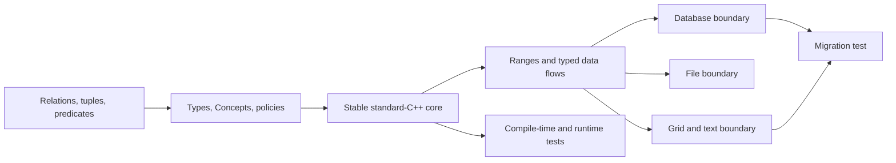
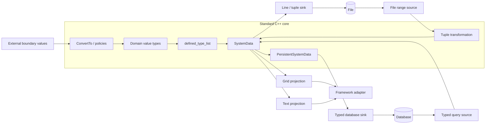
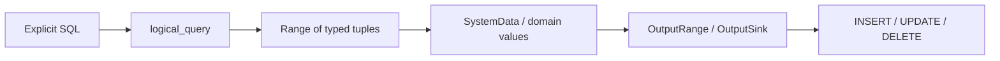
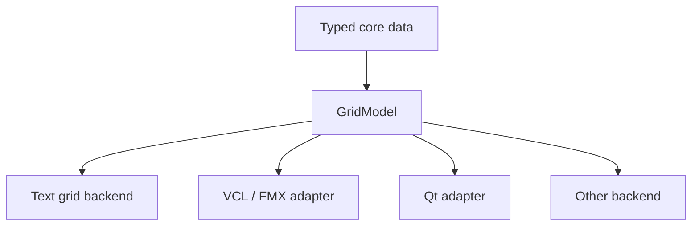
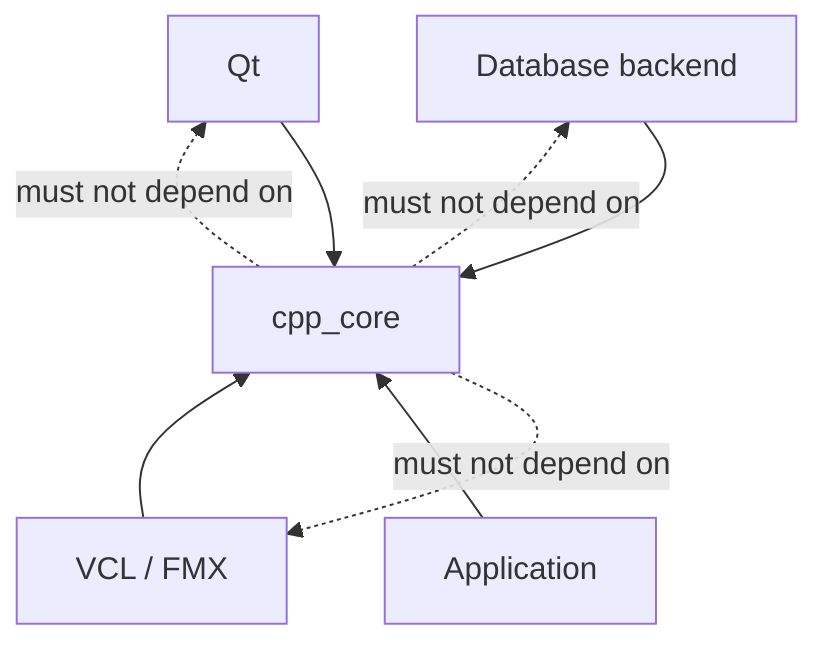

# cpp_core architecture

## Purpose

This document summarizes the architectural ideas behind `adecc/cpp_core` and connects the implementation to
Volker Hillmann's book *Rethinking C++ (C++ neu denken)*.

The book argues for an architecture that starts with types, valid relations between types, and controlled
transformations instead of starting with framework objects. In that model, the long-lived domain core is expressed
in standard C++, while databases, files, grids, text controls, and framework-specific types remain replaceable
boundaries.

This document is a companion to the source. It does not replace the book; it maps the book's architectural ideas to
the files in this directory.

## Book synopsis

*Rethinking C++ (C++ neu denken)* treats modern C++ as an architectural medium rather than as a catalogue of newer
language features. Its central claim is that durable software structure can be expressed in the type system and
checked by the compiler before runtime. Types carry meaning, Concepts describe admissible relationships, and
compile-time composition defines which forms of a system are valid.

The book develops this position in four connected steps. Part I explains why modern C++ should be read differently:
not as an imitation of other languages and not as a continuation of classical system programming alone, but as a
language in which value semantics, lifetime, generic composition, and compile-time reasoning can become architectural
tools. The distinction between a stable C++ core and replaceable technical boundaries is introduced here.

Part II uses relational and mathematical thinking to sharpen the vocabulary behind the implementation. Domains,
tuples, relations, predicates, mappings, and projections are not presented as database terminology alone. They provide
a structural model that can later be translated into C++ types, tuples, type lists, Concepts, variants, optionals,
Ranges, and controlled conversions.

The following development turns that model into practical C++ architecture. Type lists describe valid type sequences,
tuple-like values represent product structures, policies attach behavior to types, Concepts constrain legal
combinations, and conversion becomes an explicit boundary operation. Ranges then provide a common language for data
movement:

```text
Source -> Transformation -> Sink
```

Part IV applies these principles to a reusable library. Files, databases, grids, text controls, streams, persistence,
and framework adapters are treated as different boundaries around the same standard-C++ core. RAII controls ownership
and temporary state. Tests verify architectural contracts. Migration to another database or UI technology becomes a
test of dependency direction rather than merely a porting exercise.

The resulting architecture can be summarized as:



A minimal example of the book's direction is the transition from an unstructured boundary value to a typed core
value and then into a typed data object:

```cpp
using account_types =
   adecc::defined_type_list<int, std::string, adecc::money_ty>;

using account_data =
   adecc::SystemData<account_types>;

auto const aAmount = adecc::ConvertTo<adecc::money_ty>(svAmount);
account_data aAccount { iId, strName, aAmount };
```

The important point is not the individual helper. The architecture keeps conversion at the boundary, meaning in the
type space, and data movement independent of the physical framework.

## Architectural thesis

The central direction is:

1. Describe meaning in types.
2. Describe valid relationships with Concepts.
3. Represent product structures with tuples and type lists.
4. Move data through Sources, Transformations, and Sinks.
5. Keep conversions explicit and controlled at boundaries.
6. Keep domain values and invariants in the C++ core.
7. Treat databases, files, grids, text controls, and frameworks as projections or adapters.
8. Use RAII to make resource and state lifetimes deterministic.
9. Let tests verify architectural boundaries, not only result values.
10. Make migration a deliberate architecture test.

This corresponds to the book's recurring distinction between **core** and **boundary** and to its use of **type
space** as an architectural model.

## Overview



The important dependency direction is inward: framework and transport types are translated into stable C++ types.
The core does not depend on a concrete UI framework or database API.

---

## Type space, core, and boundary

The book introduces the conceptual frame of **type space, core, and boundary**. A type does more than store data: it
can express meaning, permitted construction, invariants, conversions, and relationships to other types.

In `cpp_core`, this idea appears in several layers:

- `type_traits_ext.h` classifies relevant type families.
- `type_lists.h` represents ordered compile-time type relations.
- `value_types.h` defines the shared core vocabulary.
- `fixed_numeric.h` moves numeric behavior into the type.
- `convert_core.h` controls transitions between type worlds.
- `system_data.h` turns a type list into a concrete value object.

A framework string, database value, or UI cell is therefore not automatically a domain value. It becomes one only
after an allowed conversion into the core.

### Related book sections

- *Type Space, Core, and Boundary: The Conceptual Framework*
- *Programming with Types*
- *Type Lists as Structured Type Relations*
- *Properties, Behavior, and Domain Value Types*
- *The Core Belongs in C++*

---

## Value types, policies, and conversion

The book treats conversion as boundary semantics rather than as scattered casting.

`convert_core.h` provides the uniform entry point:

```cpp
auto amount = adecc::ConvertTo<adecc::money_ty>(text);
```

The call site expresses the requested target type. A specialized conversion component decides how that transition is
performed. Optionality remains part of the type, and conversions from an empty optional value to a mandatory target
are rejected rather than silently replaced by a default value.

`fixed_numeric.h` follows the same principle. Precision and rounding behavior belong to the type:

```cpp
using money_ty =
   adecc::numeric<double, 2, adecc::RoundHalfAwayFromZeroPolicy<double>>;
```

The exact policy names in application code may differ, but the architectural point remains: the rule is attached to
the value type rather than repeated at every call site.

### Related files

- `convert_core.h`
- `convert_fixed.h`
- `convert_integral.h`
- `convert_c_time_types.h`
- `fixed_numeric.h`
- `value_types.h`
- `value_types_visitor.h`
- `chrono_workaround.h`

### Related book sections

- *Conversion as a Central Architectural Element*
- *Safe Conversions Instead of Accidental Casts*
- *Concepts as Gatekeepers of Conversion*
- *Optionality: No Value Is No Value*
- *Time Types as a Strategic Boundary*
- *Conversion as Investment Protection*

---

## Type lists, tuples, and SystemData

The book moves from relational thinking to C++ product structures. A tuple represents one typed row; a type list
describes the valid sequence of types; `SystemData` turns that sequence into a reusable C++ value object.

```cpp
using account_types =
   adecc::defined_type_list<int, std::string, adecc::money_ty>;

using account_data =
   adecc::SystemData<account_types>;
```

This avoids duplicating the same structure in several disconnected descriptions. The type list becomes a shared
compile-time source from which tuple structure, compatibility checks, and conversions can be derived.

Selected comparisons also allow identity or key semantics to be expressed without constructing a second record
type.

### Related files

- `type_lists.h`
- `tuple_check.h`
- `type_traits_ext.h`
- `system_data.h`

### Related book sections

- *std::tuple: A Type Sequence as a Single Value*
- *Type Lists as Structured Type Relations*
- *From Type Sequence to Data Class*
- *SystemData as an Application of the Type List*

---

## Source, transformation, and sink

A recurring book model is that data movement should be described independently of a concrete framework:

```text
Source -> Transformation -> Sink
```

A source produces values. A transformation changes representation or meaning. A sink consumes values. Ranges provide
the common C++ vocabulary for this movement.

This pattern is used consistently:

- database query -> typed tuple range -> transformation -> database output sink
- file line range -> tuple parser -> domain object
- domain range -> grid projection
- text source -> conversion -> domain value
- domain value -> formatting -> text or grid sink

### Related book sections

- *Source and Sink: Data Flows in Type Space*
- *Data Movement Between Source and Sink*
- *Ranges as a Universal Data Model*
- *Ranges, Lazy Processing, and Materialization*

---

## Database as a relational source and sink

The database layer deliberately does not hide SQL behind a classical ORM. SQL remains visible, while typed C++
abstractions describe rows, parameters, output values, and data flow.



This is closer to the relational model used in the book: relations contain tuples, queries produce tuples, and
changes consume typed row values.

`database_definitions.h` specifies backend requirements with Concepts. `database.h` builds the logical database
abstraction. Concrete SQL Server, PostgreSQL, or SQLite backends can satisfy those contracts without changing the
domain-facing API.

### Related files

- `database_definitions.h`
- `database.h`
- `database_exception.h`
- `value_types.h`

### Related book sections

- *Database as a Relational Source and Sink*
- *Database as Source, Transformation, and Sink*
- *Why This Is Not a Classical ORM: SQL Remains Visible*
- *Values, Parameters, and the Defined Database Type Space*

---

## PersistentSystemData

`PersistentSystemData` extends the typed row with persistence metadata. Table names, attribute names, keys,
identities, read-only fields, and projections are validated structurally and can be used to derive repetitive SQL
fragments.

The essential direction is:

```text
defined_type_list
      |
   SystemData
      |
persistence metadata
      |
PersistentSystemData
      |
SQL builders / executor
```

Persistence therefore extends the typed core instead of replacing it with a framework record or reflection-based
runtime model.

For multi-table data, projections identify which tuple positions belong to which table. The full domain tuple can
remain stable even when persistence is distributed over several relations.

### Related files

- `details/system_data_persistent_basic.h`
- `details/system_data_persistent_builder.h`
- `system_data_persistent.h`
- `system_data_persistent_executor.h`

### Related book sections

- *SystemData as an Application of the Type List*
- *PersistentSystemData as an Extension of SystemData*
- *Database as Source, Transformation, and Sink*

---

## Files as typed data flows

The book treats a file as a resource and a data flow, not as a separate application model.

RAII controls the file lifetime. A range exposes lines. Transformations convert text into typed tuples. A sink writes
values back.

```cpp
auto rows =
   adecc::FromCsvFileTyped<true, true, account_types>(
      file,
      ";",
      true);
```

The architectural value is not the CSV helper itself. The important point is that the file participates in the same
typed Source/Transformation/Sink model as the database.

### Related files

- `FileOperations.h`
- `file_range.h`
- `file_as_tuple.h`
- `file_line_sink.h`
- `generator.h`

### Related book sections

- *Files as Typed Data Flows*
- *Files as Ranges: Resources, Tuples, and RAII*
- *Practical Example: Financial Data as a Typed Data Flow*

---

## Grid projection and UI boundaries

The book explicitly describes a grid as a projection, not as the source of domain truth.

The grid wrappers therefore expose rows, cells, ranges, views, and sinks while leaving physical UI behavior to a
backend. A VCL, FMX, Qt, or textual backend can implement the required Concepts.



The model controls typed data access. The backend controls physical UI operations such as row creation, painting,
signal blocking, or wait cursors.

### Related files

- `grid_backend_concepts.h`
- `grid_wrapper.h`
- `grid_sequential_adapter.h`
- `grid_wrapper_basic.h`
- `text_grid_wrapper.h`
- `wrapper_basic.h`

### Related book sections

- *Grid Models as the Next Step*
- *Grids as Ranges: The UI Loses Its Special Status*
- *The Grid as a Projection, Not as Truth*
- *From Text and Grid to a General Adapter Strategy*

---

## Text wrappers and stream integration

Text controls are treated in the same way as grids: they are boundaries over typed data rather than domain models.

`text_wrapper.h` exposes line-oriented models as ranges and sinks. `stream_wrappers.h` bridges these models to
standard iostreams. `stream_tools.h` groups coherent character and stream types into policies.

This allows an existing stream-based algorithm to target an in-memory text model, a UI text control, or a textual
grid without pulling framework types into the core.

### Related files

- `text_wrapper.h`
- `stream_tools.h`
- `stream_wrappers.h`
- `stream_redirect.h`

### Related book sections

- *Text Wrapper and the Universal Wrapper Concept*
- *Text as a Range*
- *Output Iterators and Standard Algorithms*
- *Text as a Source*
- *StreamPolicy: Type Families as Architectural Building Blocks*

---

## RAII and deterministic state

RAII is used for more than memory ownership. It also controls temporary state:

- file lifetimes
- stream redirection
- database transactions
- grid freeze/unfreeze state
- signal blockers
- wait cursors
- scope-exit actions

`scope.h`, `stream_redirect.h`, `wrapper_basic.h`, and the transaction utilities in `database.h` make these
lifetimes explicit and exception-safe.

### Related book sections

- *Typed Runtime Structure and RAII*
- *stream_redirect: RAII over Changed State*
- *Files as Ranges: Resources, Tuples, and RAII*

---

## Exceptions as diagnostic carriers

The book describes exceptions in the core as standard C++ exceptions with additional context rather than as
framework-specific error objects.

`piggyback_exceptions.h` adds diagnostic history and source context. `database_exception.h` adds server, query, and
parameter information while preserving normal exception semantics.

This supports an important architectural rule: error information may become richer when it crosses layers, but the
core exception mechanism remains standard C++.

### Related book sections

- *Exceptions in the Domain Core: Standard C++ with a Backpack*
- *What Conversion and Error Handling Achieve Together*

---

## Cost model and efficiency

The book repeatedly stresses that abstraction should not hide its cost model. The goal is not to avoid abstraction,
but to express structure without silently introducing unnecessary dynamic allocation, reflection, runtime lookup, or
materialization.

Examples in `cpp_core` include:

- compile-time Concepts instead of runtime capability checks where possible
- ranges and views for lazy processing
- explicit materialization when ownership is required
- fixed-capacity storage for bounded histories
- value semantics and standard containers
- policy and template composition instead of mandatory runtime inheritance
- typed adapters that isolate dynamic framework behavior at the boundary

This is also why the library favors standard C++ building blocks that can be optimized by the compiler.

### Related book sections

- *The Cost Model of Abstraction*
- *Efficiency Is Responsibility*
- *Library Instead of Framework*

---

## Tests as architectural proof

The tests under `tests/` are not only value checks. They verify that the architectural contracts are real:

- typed ranges can cross the database boundary
- generated identities return to the caller
- optional and mandatory values retain their semantics
- transactions obey RAII rules
- persistence metadata generates coherent SQL
- the same logical tests can run against different SQL dialects
- file, range, grid, and persistence components compose without a framework-owned core

The database dialect helpers make differences between SQL Server, PostgreSQL, and SQLite explicit instead of hiding
them behind assumptions.

### Related book sections

- *Tests as Architectural Proof*
- *Migration as an Architecture Test*
- *Limits, Tests, and Migration*

---

## Migration as an architecture test

The book treats migration as a particularly strong test of architectural quality. A dependency that looked harmless
inside one framework becomes visible when a second framework, database, or runtime must be connected.

The PostgreSQL and SQLite test variants therefore have architectural value beyond database portability. They test
whether the logical database layer really depends on typed contracts rather than on SQL Server behavior.

The same rule applies to UI adapters: if a grid or text abstraction can be connected to another physical backend
without changing the domain core, the boundary is doing its job.

---

## File map

| Area | Main files | Architectural role |
| --- | --- | --- |
| Conversion | `convert_*.h`, `chrono_workaround.h` | Controlled boundary semantics |
| Value types | `fixed_numeric.h`, `value_types.h` | Meaning and invariants in types |
| Type structure | `type_lists.h`, `type_traits_ext.h` | Compile-time relations and constraints |
| Domain rows | `system_data.h` | Typed data object derived from a type list |
| Persistence | `system_data_persistent*.h`, `details/*` | Metadata-driven relational persistence |
| Database | `database*.h` | Typed relational Source/Sink abstraction |
| Files | `file_*.h`, `FileOperations.h` | Typed file Sources and Sinks |
| Ranges | `generator.h`, range-based adapters | Lazy data movement |
| Grids | `grid_*.h`, `text_grid_wrapper.h` | UI projection over core data |
| Text | `text_wrapper.h`, `stream_*.h` | Text projections and stream bridges |
| RAII | `scope.h`, `stream_redirect.h`, guards | Deterministic state and lifetime |
| Diagnostics | `piggyback_exceptions.h`, `database_exception.h` | Context-rich standard exceptions |
| Tests | `tests/*.h` | Architectural proof and migration checks |

---

## Dependency rule

A practical review rule for future changes is:

> A file belongs in `cpp_core` only if its stable meaning can be expressed in standard C++ without requiring a
> concrete application framework.

Framework adapters may depend on `cpp_core`. The reverse dependency should be avoided.



This is the practical meaning of the book's conclusion that the core belongs in C++.

---

## Review checklist for new cpp_core code

When adding or changing a component, ask:

- Is the concept part of the stable C++ core or only a framework boundary?
- Can an invariant be expressed in a type, Concept, or policy instead of a convention?
- Is absence represented explicitly with `std::optional` where appropriate?
- Is a conversion controlled through the conversion architecture?
- Can a sequence be expressed as a Range rather than as a bespoke iteration protocol?
- Is ownership or temporary state protected by RAII?
- Does the abstraction expose its cost model?
- Does the design preserve SQL or other domain-relevant languages where hiding them would reduce clarity?
- Can the same core be tested without a UI framework?
- Would changing database or UI technology require changes in the core?
- Are comments and documentation describing intent rather than preserving obsolete code?
- Are headers self-contained, documented, and limited to lines of at most 120 characters?

If the final question about migration reveals a core dependency on a boundary technology, the dependency direction
should be reconsidered.
